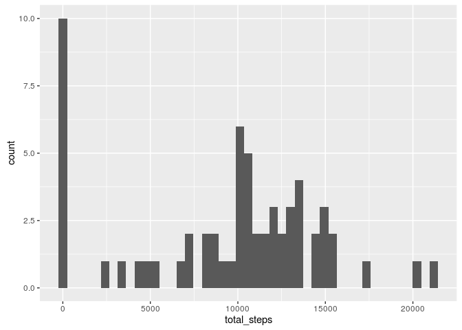
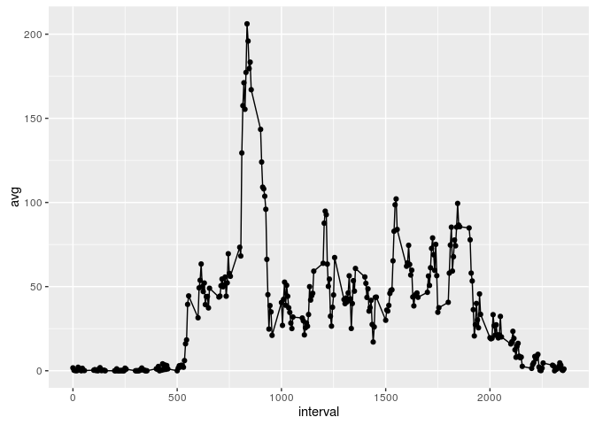
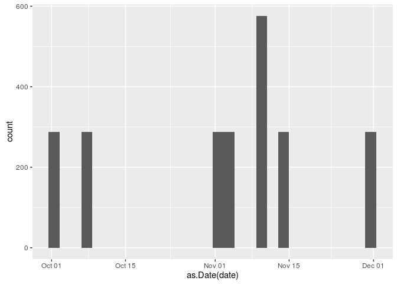
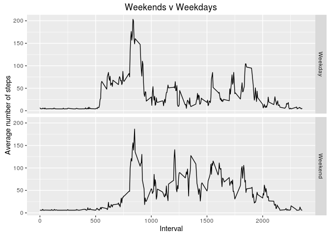

# Reproducible Research: Peer Assessment 1
Sergio Cordero  
March 28, 2016  

### Dependencies


```r
library(ggplot2)
library(dplyr)
```

```
## 
## Attaching package: 'dplyr'
```

```
## The following objects are masked from 'package:stats':
## 
##     filter, lag
```

```
## The following objects are masked from 'package:base':
## 
##     intersect, setdiff, setequal, union
```


## Loading and preprocessing the data

Making sure the folder is inside the git repository and the zip with the raw data is unzipped:


```r
df <- read.csv("activity.csv")
```

## What is mean total number of steps taken per day?


```r
by_date <- group_by(df, date)
per_day <- summarise(by_date,
                   total_steps=sum(steps, na.rm=TRUE))

pl <- ggplot(per_day, aes(total_steps))
pl + geom_histogram(bins=45)
```



```r
mn <- mean(per_day$total_steps, na.rm=TRUE)
md <- median(per_day$total_steps, na.rm=TRUE)
```

We can see that there is a lot of data missing, since there are 10 days with 0 (or missing) values. We also calculate the mean at 9354.2295082 and the median at 10395

## What is the average daily activity pattern?


```r
by_interval <- df[,c("steps", "interval")] %>%
     group_by(interval) %>%
     summarise(avg=mean(steps, na.rm=TRUE))

pl <- ggplot(by_interval, aes(interval, avg))
pl + geom_point() + geom_line()
```



We see that the maximum avg of steps was 206.1698113 found at 104, which is the range of minutes of 835 + 5

## Imputing missing values

We first check NA amount

```r
sum(is.na(df$steps))
```

```
## [1] 2304
```
Time to see how they are distributed

```r
nas <- df[is.na(df$steps),]
qplot(as.Date(date), data=nas)
```

```
## `stat_bin()` using `bins = 30`. Pick better value with `binwidth`.
```


We can see that most days missing are only on a specified hour, lets find the average for that time

```r
first <- nas$date == "2012-10-01"
first <- nas[first,]
range(first$interval)
```

```
## [1]    0 2355
```
So apparently its from the interval 0, 2355
Now we find the average for that interval without the NAs

```r
nonas <- df[!is.na(df$steps),]
relevant <- nonas[nonas$interval %in% unique(first$interval),]
mean(relevant$steps)
```

```
## [1] 37.3826
```
From this, we get that our mean is 37.3825996 so we substitute all missing values for that number

```r
nas <- is.na(df$steps)
df[nas,"steps"] = mean(relevant$steps)
```
We can check there are no more NAs with 0

## Are there differences in activity patterns between weekdays and weekends?

First we separate the data on weekends and weekdays

```r
weekend <- weekdays(as.Date(df$date)) %in% c("Friday", "Saturday", "Sunday")
df <- cbind(df, weekend)
by_dayType <- df %>%
    group_by(weekend, interval) %>%
    summarise(avg=mean(steps))
```
Now we graph it

```r
wd <- by_dayType[,1] == FALSE
we <- by_dayType[,1] == TRUE
by_dayType[wd,1] = "Weekday"
by_dayType[we,1] = "Weekend"
pl <- ggplot(by_dayType, aes(interval, avg))
pl + geom_line() + facet_grid(weekend ~ .) + labs(title="Weekends v Weekdays", x="Interval", y="Average number of steps")
```


